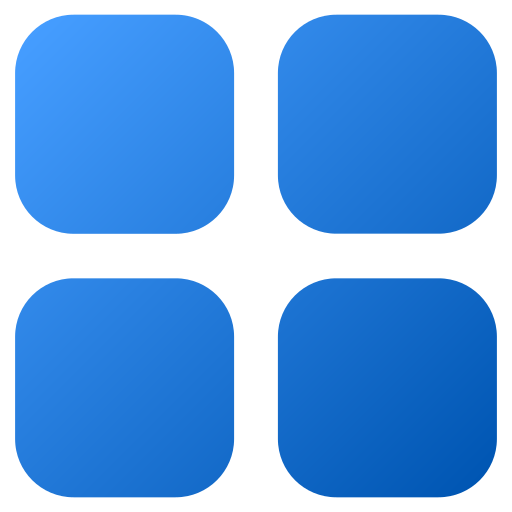
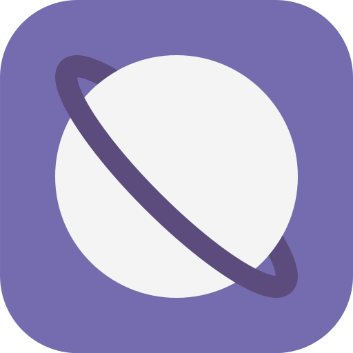
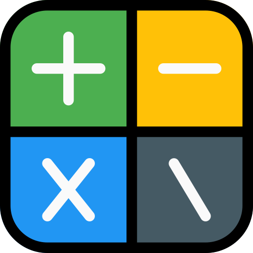
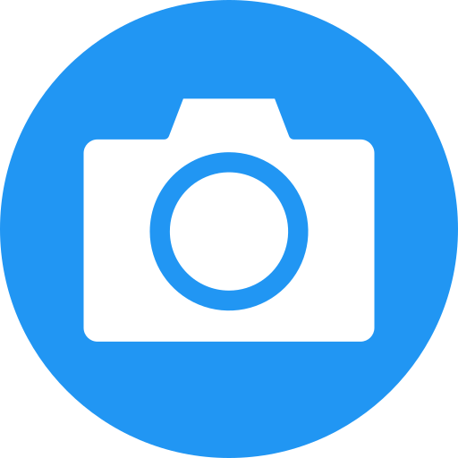
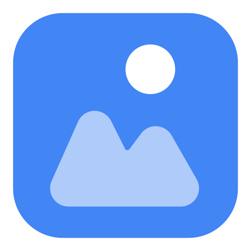
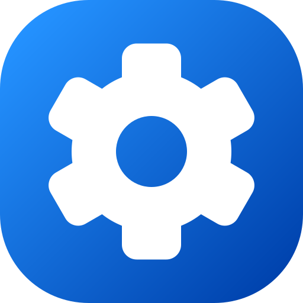

# NIRDESH OS

<p align="center">
  <strong>A small desktop-style environment that runs in the browser.</strong>
</p>

<p align="center">
  <a href="https://github.com/nonopepep7-maker/Nirdesh-OS">
    
  </a>
  <a href="https://github.com/nonopepep7-maker/Nirdesh-OS/issues">
    
  </a>
  <a href="https://github.com/nonopepep7-maker/Nirdesh-OS/blob/main/LICENSE">
    
  </a>
</p>

<p align="center">
  <a href="https://youtu.be/tw0wvRHh_NQ">Watch Demo</a>
  &nbsp;·&nbsp;
  <a href="https://github.com/nonopepep7-maker/Nirdesh-OS/issues">Report a Bug</a>
  &nbsp;·&nbsp;
  <a href="https://github.com/nonopepep7-maker/Nirdesh-OS/issues">Request a Feature</a>
</p>

---

## About

Nirdesh OS is a browser project that looks and works a bit like a desktop operating system.

You get a desktop, taskbar, app drawer, windows, settings, browser, camera, gallery, calculator, wallpapers, clock, and volume control.

It is made with plain web technologies and runs in a browser. It is not a real operating system kernel.

---

## What is inside

### Desktop

The main desktop has:

* draggable windows
* minimize, maximize, and close buttons
* taskbar
* app drawer
* live clock
* volume control
* wallpaper switching

### Apps

| App        | What it does                               |
| ---------- | ------------------------------------------ |
| Browser    | Open a URL or search the web               |
| Camera     | Take photos and record videos              |
| Gallery    | View and delete saved media                |
| Calculator | Do basic calculations                      |
| Settings   | Change wallpapers and view system sections |
| App Drawer | Open the available apps                    |

---

## Browser

The browser window has a URL bar and a search box.

Enter a full URL to open it.
Enter normal text to search it through Google.

---

## Camera

The Camera Studio uses your browser camera and microphone.

It has:

* photo mode
* video mode
* live camera preview
* recording timer
* quick preview

The browser will ask for camera and microphone permission.

---

## Gallery

Photos and videos taken with the camera are saved in the browser.

The gallery can:

* show photos
* play recorded videos
* open media in a larger view
* delete one item
* delete everything

The media is kept in browser `localStorage`, so it is local to the browser.

---

## Calculator

The calculator supports:

* addition
* subtraction
* multiplication
* division
* decimals
* percentage
* positive/negative
* clear

Nothing extra is needed for it to work.

---

## Settings

The current Settings page contains:

* Display & Wallpaper
* Lockscreen
* Media
* About
* Designs & Themes

Some of these sections are still being worked on.

---

## Wallpaper

You can change the desktop wallpaper from Settings.

The selected wallpaper is saved in local storage and loaded again when the page is opened.

---

## 3D Page

There is also a separate `3dgame.html` page with a Spline 3D scene.

It uses the Spline Viewer from the Spline package.

---

## Android Page

The project also contains an Android page with two buttons:

* Download APK
* Try In Browser

This is part of the Android side of the project.

---

## Screenshots

### App Drawer

<p align="center">
  
</p>

### Browser

<p align="center">
  
</p>

### Calculator

<p align="center">
  
</p>

### Camera

<p align="center">
  
</p>

### Gallery

<p align="center">
  
</p>

### Settings

<p align="center">
  
</p>


---

## Built With

* HTML
* CSS
* JavaScript
* Tailwind CSS

The project also uses browser APIs for camera, microphone, media recording, and local storage.

---

## Project Files

```text
Nirdesh-OS/
│
├── index.html
├── desktop.html
├── desktop.js
├── desktop2.js
├── android.html
├── 3dgame.html
├── home.html
├── login.html
├── loginand.html
├── download.html
│
├── 1.png
├── app-drawer.png
├── browser.png
├── calculator.png
├── calculator2.png
├── camera.png
├── gallery.png
├── settings.png
│
├── blood-moon-5k-3840x2160-93.jpg
├── madden-nfl-26-neon-3840x2160-22297.jpg
├── monkey-d-luffy-one-piece-minimal-art-5k-8k-3840x2160-8211.png
├── planet-astronomy-outer-space-colorful-black-background-5k-8k-3840x2160-1514.jpg
├── vortex-black-hole-astronomy-3840x2160-5415.jpg
│
├── favicon.ico
├── LICENSE
└── README.md
```

---

## Run It

No package installation is needed.

Clone the repo:

```bash
git clone https://github.com/nonopepep7-maker/Nirdesh-OS.git
```

Open the folder:

```bash
cd Nirdesh-OS
```

Then open:

```text
desktop.html
```

in your browser.

### For development

Using VS Code, the easiest way is to install **Live Server** and open `desktop.html` with it.

A local server is especially useful for camera and microphone features.

---

## Browser

Nirdesh OS is made for modern browsers.

Chrome, Edge, Firefox, and Brave should work for the main features.

Camera and microphone features depend on browser permissions and device support.

---

## Local Data

The project stores some data in the browser itself.

Wallpaper settings are saved locally.

Photos and videos from the camera are also stored locally in `localStorage`.

Clearing the browser's site data can remove that saved media.

---

## Current State

Nirdesh OS is still being worked on.

The main desktop and several applications are already there, while some parts of Settings are unfinished.

More apps and improvements will be added as the project grows.

---

## Developer

**Nirdesh Acharya**

Built in Nepal.

This project started as a way to learn by actually building something instead of only following tutorials.

---

## License

MIT License.

See [`LICENSE`](LICENSE) for the full text.

---

## GitHub Streak

<p align="center">
  
</p>

---

<p align="center">
  Nirdesh OS
</p>
